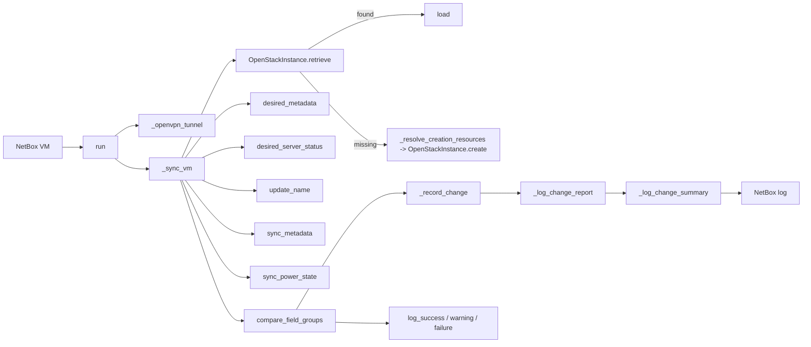

# netbox-scripts

This NetBox custom script keeps VM records aligned with OpenStack.

It can create missing instances, update metadata, rename servers, sync power
state, and compare OpenStack-only fields for drift.

How it works:

- `run()` starts the script and opens the VPN tunnel when needed.
- `_sync_vm()` finds the matching OpenStack server and compares it to NetBox.
- `sync_metadata()` and `sync_power_state()` apply live changes when enabled.
- `compare_field_groups()` checks flavor, AZ, key name, security groups, and
  flavor sizing.
- `_log_change_report()` writes the colored NetBox report.
- `_log_change_summary()` prints the debug-only markdown recap.

